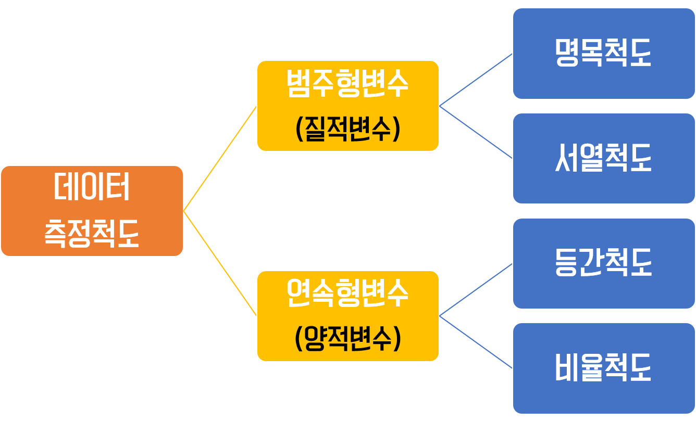
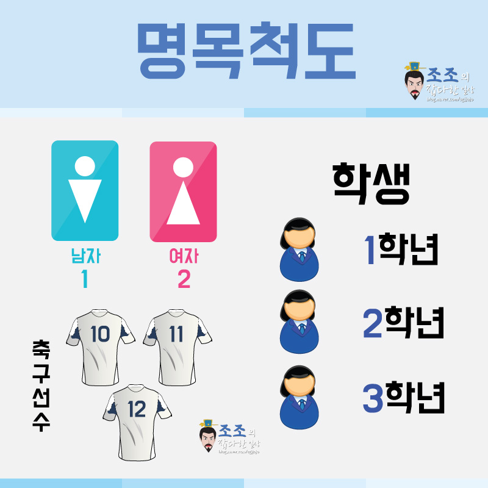
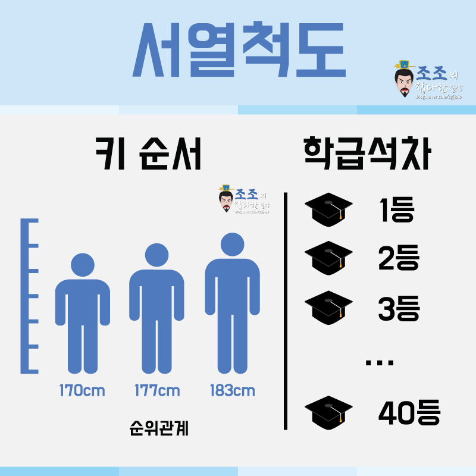
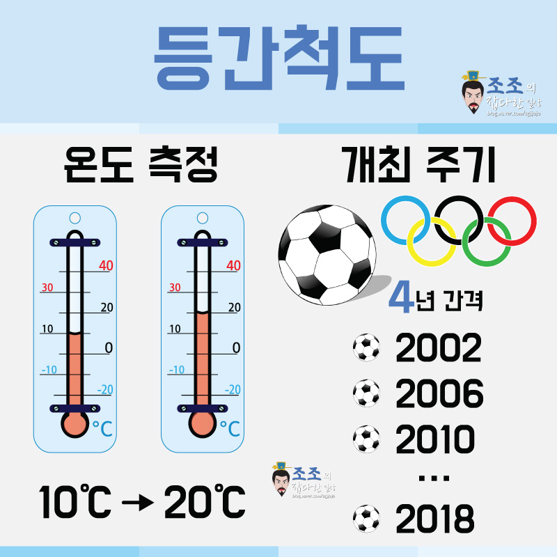
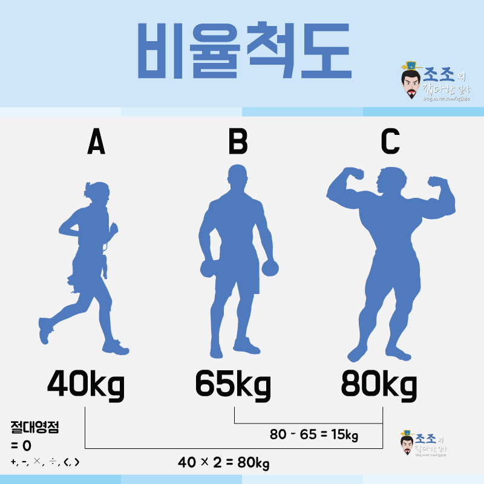
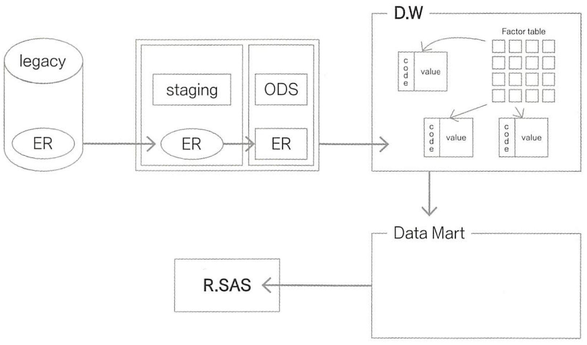

# 데이터 전처리 개요

## #01. 데이터의 이해

### [1] 데이터

하나 이상의 변수에 대한 관찰값의 모음

어떤 현상을 이해하기 위해 그 현상을 관찰하여 데이터를 수집

전통적인 데이터 수집 방법 -> 관찰, 설문조사, 실험등

### [2] 데이터의 기본 요소

| 이름 | 설명 |
|---|---|
| 단위(Unit) | 관측되는 개별 대상
| 변수(variable) | 각 단위에 대해 관측되는 특성 |
| 관찰값(observation) | 각 단위로부터 관측한 특성의 값 |

#### 예시: 4명의 데이터

> 시연이는 여성이고 키161cm, 몸무게50kg이다.
> 이안이는 남성이고 키175cm, 몸무게73kg이다.
> 연하는 여성이고 키163cm, 몸무게55kg이다.
> 가현이는 여성이고 키171cm, 몸무게60kg이다.

| 이름 | 성별 | 키(cm) | 몸무게(kg) |
|:---:|:---:|:---:|:---:|
| 시연 | 여 | 161 | 50 |
| 이안 | 남 | 175 | 50 |
| 연하 | 여 | 163 | 55 |
| 가현 | 여 | 171 | 60

- 단위 : 시연이, 이안이, 연하, 가현이
- 변수 : 성별, 키, 몸무게

### [3] 데이터 폭발(Data explosion)

컴퓨터와 정보통신 기술의 발달로 매일 방대한 양의 데이터가 생산됨

> 뉴욕타임즈가 하루에 싣는 정보의 양은 17세기 영국의 평범한 한 사람이 평생 소비 하는 정보의 양과 비슷하다 (Wurman, S.A. (1987) "Information Anxiety" New York: Doubleday , p.32)

> 페이스북에서는 하루에 4페타 바이트의 정보가 생성된다 (https://kinsta.com/blog/facebook-statistics/, Jan 3, 2021)

1페타바이트 = 1024테라바이트

## #02. 데이터 전처리의 이해

데이터를 본격적으로 분석하기 전에 분석에 적합하게 데이터를 가공하는 작업

데이터 가공(Data Manipulation), 데이터 핸들링(Data Handling)도 비슷한 의미로 사용되는 용어

### [1] 데이터 전처리에서 수행되는 주요 작업

#### (1) 행,열 재배치 

단일 데이터 프레임에 대한 작업

- 행 혹은 열(변수)에 대한 재배치, 이름 변경
- 정렬
- 특정 데이터 필터링
- 행 혹은 열 추가, 삭제
- 데이터 타입 변경
- 파생변수 추가
- 더미변수 추가

#### (2) 행,열 병합

두 개 이상의 데이터프레임을 다루거나 새로운 데이터프레임이 생성되는 형태

- 다른 데이터 프레임과 데이터 합치기 (열)
- 다른 데이터 프레임과 데이터 합치기 (행)

#### (3) 데이터 재구조화

- 피벗 테이블
- melt
- stack, unstack
- 교차표
- wide_to_long

#### (4) 그룹별 집계

- groupby

#### (5) 데이터 분할

- 머신러닝을 위한 학습용 데이터와 검증용 데이터로 분할하는 작업

## #03. 변수의 이해

### [1] 변수와 데이터

| 용어 | 설명 |
|--|--|
| 변수 | 각 단위(Unit, row)에 대해 관측되는 특성 |
| 데이터 | 하나 이상의 변수에 대한 관찰값의 모음 |

### [2] 변수의 종류

#### (1) 척도

사물이나 사람 등 대상의 특성을 통계상의 수로 표현하기 위해 체계적으로 숫자를 부여한 것

#### (2) 범주형 자료 (categorical qualitative)

질적자료라고도 한다

##### 명목척도

<ul>
<li>대상을 특성에 따라 카테고리로 분류하여 기호를 부여한 것</li>
<li>측정이 이루어지는 항목들이 상호배타적인 특성만 가진척도</li>
<li>비교 방법 : 확인, 분류</li>
<li>연산 방법 : `=`</li>
<li>통계값 : 최빈치</li>
<li>적용 가능한 추론통계 방법 : 비모수 통계, 빈도 분석, 교차 분석</li>
<li>예시: 성별, 이름, 지역, 학년 등</li>
</ul>

##### 서열척도

<ul>
<li>대상의 특성들을 구분할 수 있으며 이들 사이의 상대적인 크기를 나타낼 수 있고 서로 간 비교가 가능한 척도</li>
<li>명목척도들 중 항목들 간에 서열이나 순위가 존재하는 척도</li>
<li>비교방법: 순위비교</li>
<li>연산: `=`, `<`, `<=`, `>`, `>=`</li>
<li>통계값: 최빈값, 중앙값</li>
<li>적용 가능한 추론통계 방법 : 비모수 통계, 서열 상관관계</li>
<li>예시: 교육정도(중졸, 고졸, 대졸 이상), 선호도 순위, 학점</li>
</ul>

#### (3) 연속형자료(Numerical quantitative)

양적자료라고도 한다.

##### 등간척도

<ul>
<li>상호간의 서열뿐 아니라 인접한 두 변수 값의 차이가 일정한 변수</li>
<li>서열척도들 중 항목들 간의 간격이 일정한 척도</li>
<li>비교방법 : 간격비교</li>
<li>연산 : `+`, `-`, `=`, `<`, `<=`, `>`, `>=`</li>
<li>통계값 : 최빈값, 중앙값, 산술평균</li>
<li>적용 가능한 추론통계 방법 : 모수 통계</li>
<li>예시: 온도, 연도(올림픽, 월드컵), IQ, 만족도( 매우불만족,약간불만족,보통,약간만족,매우만족)</li>
</ul>

##### 비율척도

<ul>
<li>상호간 서열, 크기 차이, 크기의 비교, 특성들 간의 계산까지 가능한 척도</li>
<li>`0`값을 갖는 것이 가능하고 사칙연산이 가능하다.</li>
<li>비교방법 : 절대크기비교</li>
<li>연산 : `+`, `-`, `=`, `<`, `<=`, `>`, `>=`</li>
<li>통계값 : 최빈값, 중앙값, 기하평균, 조화평균 등</li>
<li>적용 가능한 추론통계 방법 : 모수 통계</li>
<li>예시: 무게, 키, 길이, 임금, 나이(`20세 이하`,`21~30세`,`31~40세`,`41~50세`, `0`이라는 개념은 아직 태어나지 않음을 뜻함)</li>
</ul>

## #04. 주요 용어

| 용어 | 설명 |
|--- |---|
| legacy | 기업 업무에 필요한 기존 운영 시스템 `예) 마케팅, 세일즈, ERP, CMS` |
| staging | 데이터를 가공 없이 로딩 하는 영역 `예) 비정형 데이터` |
| ODS | 로딩된 데이터를 DW에 저장하기 전에 임시로 저장하는 영역 `예) 비정형 —> 정형 데이터로 처리` | 
| 데이터웨어하우스(DW) | DW란 운영계 데이터를 사용자 관점에서 주제별로 통합하여, 별도의 장소에 저장해 놓은 통합 데이터베이스. |  |
| 데이터마트(DM) | 분석의 편의성을 높이고자, DW의 데이터를 주제별, 업무별로 요약하여 구성한 데이터 저장소. 일반적으로 각 부서별로 다양한 예측과 분석을 목표로 만들어진다. `예) DataFrame` |

### [1] 활용

- 데이터웨어하우스(DW), 데이터마트(DM)를 통해 분석 데이터를 가져와 사용
- Legacy System이나 Staging Area에서 데이터를 가져와서 DW에서 가져온 내용과 결합하여 사용 가능하지만 보안에 취약한 방법이기 때문에 거의 이루어지지 않음
- 클린징 영역인 ODS(Operation Data Store)에서 데이터의 전처리를 해서 DW나 DM과 결합하여 사용하는 것이 이상적

### [2] 최종 데이터 구조로 가공

분류값과 입력 변수들을 연관시켜 인구통계, 요약변수, 파생변수 등을 산출

| 구분 | 설명 |
|---|---|
| 비정형 데이터 | DBMS에 저장됐다가 텍스트 마이닝을 거쳐 데이터 마트와 통합 |
| 관계형 데이터 | DBMS에 저장되어 사회 신경망분석을 거쳐 분석 결과 통계값이 마트와 통합되어 활용 |

## 참고문헌

> https://blog.naver.com/sgjjojo/221270160250