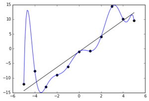
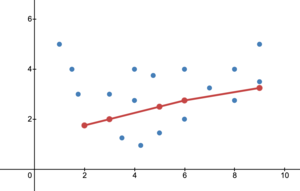

# 규제를 포함하는 회귀

## #01. 과적합(Overfitting)의 이해

실제 데이터와 머신러닝의 추정치가 일치하지 않는 현상으로 과대적합과 과소적합이 있다.

> 위 그림은 순서대로 과대적합, 과소적합, 최적(일반화)상태를 의미

### [1] 과적합의 구분

#### (1)  과대적합 (Over Fitting)

모델이 너무 복잡해서 데이터의 구조를 제대로 학습하지 못하는 경우.

> 모델이 복잡하다는 것은 요인이 너무 많다는 것을 의미함

훈련 정확도보다 검증 정확도가 현저하게 떨어진다.

> ex) 훈련정확도가 `99%`이지만 검증 정확도는 `65%`인 경우

##### 해결방법

- **샘플 수를 늘려서 모델이 충분히 학습할 수 있도록 함**
- 훈련 데이터의 특성 수를 줄임 (차원축소)
- 훈련 데이터의 잡음을 줄임 (이상치 제거)
- 파라미터 수가 적은 모델을 선택
- 모델을 단순화 시킴

> 결국은 변수를 줄이거나 가중치를 제한하라는 뜻

#### (2) 과소적합 (Under Fitting)

분석 모델이 너무 단순해서 데이터의 구조를 제대로 학습하지 못하는 경우.

> 모델이 단순하다는 의미는 변수(피처)의 수가 부족함을 의미함

훈련 정확도와 검증 정확도의 차이는 크지 않지만 전체적으로 낮은 성능을 내는 경우

##### 해결방법

- **변수의 수를 늘림**
- 모델 파라미터가 더 많은 모델을 선택 (단순선형회귀 -> 다항회귀)
- 학습 알고리즘에 더 좋은 특성을 제공(하이퍼파라미터 튜닝)
- 모델의 제약을 줄인다.

> 결국은 모델을 더 복잡하게 만들기 위해 변수를 늘리라는 뜻

#### (3) 일반화

실제 데이터가 학습 데이터와 차이가 있더라도 생성된 모델의 성능 차이가 나타나지 않게 하는 것

##### 일반화 방법

###### 속성 줄이기

- 복잡성이 너무 높을 경우 과대적합 확률이 높음.
- 결과에 크게 영향을 주지 않는 속성을 제거

###### 정규화

- 속성의 단위가 서로 달라서 결과에 여향을 미치는 영향이 달라지는 것을 방지하기 위해 사용함

###### 검증

- 오류의 정도를 측정하고 그 결과를 바탕으로 모델의 성능을 개선함

## #02. 학습 곡선 (Learning Curve)

학습 데이터의 양을 늘려가면서 모델의 성능을 평가하여 그래프로 그리는 것.

이를 통해 현재 데이터의 양이 적당한지, 더 모으면 모델의 성능이 증가할지 등에 대한 단서를 얻을 수 있다.

sklearn에서는 교차 검증을 사용하여 모델을 훈련하고 평가하는 `learning_curve()` 함수가 있다.

훈련 세트의 크기를 증가시키면서 모델을 재훈련하고 모델을 평가한 훈련 세트 크기와 각각의 샘플 크기와 교차 검증 폴드에서 측정한 훈련 및 검증 점수를 반환한다.

### [1] 과소적합에 대한 학습곡선

#### 훈련 데이터에 대한 설명

1. 그래프가 `0`에서 시작하므로 훈련 세트에 하나 혹은 두 개의 샘플이 있을 때는 모델이 완벽하게 작동한다.
2. 하지만 훈련 세트에 샘플이 추가됨에 따라 점점 모델이 훈련 데이터를 완벽히 학습하는 것이 불가능해 진다. 그래서 곡선이 어느 정도 평편해질 때까지 오차가 계속 상승한다.
3. 어느 정도 평편해진 후에는 대체로 일정하게 유지된다. 이 위치에서는 훈련 세트에 샘플이 추가되어도 평균 오차가 크게 나아지거나 나빠지지 않는다.
4. 그렇다면 이 모델은 이후 더 많은 데이터를 학습하더라도 성능 향상을 기대하기 어렵다.

#### 검증 데이터에 대한 설명

1. 모델이 적은 수의 훈련 샘플로 훈련될 때는 제대로 일반화 될 수 없기 때문에 검증 오차가 초기에 매우 크다.
2. 모델에 훈련 데이터가 추가됨에 따라 학습이 되고 검증 오차가 천천히 감소한다.
3. 하지만 선형 회귀의 직선은 데이터를 정확히 모델링 할 수는 없기 때문에 오차가 완만하게 감소하면서 훈련 세트의 그래프와 가까워진다.

> 과소적합은 훈련 샘플을 더 추가해도 효과가 없다. 더 복잡한 모델을 사용하거나 더 나은 특성을 선택해야 한다.

### [2] 과대적합에 대한 학습곡선

1. 훈련 데이터의 오차가 이전보다 훨씬 낮다.
2. 두 곡선 사이에 공간이 있다.
    - 이 말은 검증 데이터보다 훈련 데이터에서 모델이 훨씬 더 나은 성능을 보인다는 것을 의미한다. 
    - 이는 과대적합 모델의 특징이다.
    - 그러나 더 큰 훈련 세트를 사용하면 두 곡선이 점점 가까워진다.

> 과대 적합 모델을 개선하는 방법은 검증 오차가 훈련 오차에 근접할 때 까지 더 많은 훈련 데이터를 추가하는 것이다.

## 참고

학습곡선과 비슷한 목적으로 사용되는 시각화 자료로 검증곡선(Validation Curve)이 있다.

검증곡선은 모델 객체를 생성하는 과정에서 설정되는 하이퍼파라미터중 하나의 값을 조절해 가면서 학습률을 시각화 하여 비교하는 형태이다.

하지만 이미 GridSearchCV를 통해 최적의 하이퍼파라미터를 찾는 기능을 구현하고 있기 때문에 검증곡선을 직접 확인해가면서 직접 최적의 하이퍼파라미터를 찾는 과정은 번거로움을 추가할 뿐이라 할 수 있겠다.

## #03. 과적합 해결 과정

1. 과소적합 상태의 모형에 특성을 추가한다.
2. 특성이 추가되면 훈련데이터에 대한 정확도는 높아지지만 검증데이터에 대한 정확도는 떨어지는 과대적합 상태가 된다.
3. 과대적합을 해결하기 위해 다시 특성을 축소하기도 하지만 규제를 적용하여 해결하기도 한다.

### [1] 규제

과대적합이 되지 않도록 모델을 강제로 제한하는 방식

### [2] 규제가 적용된 회귀 모형

#### (1) 릿지회귀

선형회귀모형의 과대적합 문제를 해소하기 위해 가중치의 절댓값을 가능한 한 작게 만들어 w의 모든 원소가 0에 가깝게 한다.

릿지 회귀에 사용하는 규제 방식을 L2규제라고 한다.

$$\beta_{ridge} : argmin[\sum_{i=1}^n(y_i - \beta_0 - \beta_1x_{i1}-\dotsc-\beta_px_{ip})^2 + \lambda\sum_{j=1}^p\beta_j^2]$$

##### 장점

샘플수 보다 독립변수가 상대적으로 많을 경우, 일반 표준 선형회귀보다 릿지회귀가 더욱 우수한 성능을 발휘한다.

릿지 회귀분석은 회귀계수를 0에 가깝도록 축소시키지만 어떤 회귀계수도 0으로 만들지는 않는다.

즉, 원래 데이터셋에 있는 모든 독립변수가 릿지회귀에서도 그대로 적용된다.

따라서 단계선택법을 통해 통계적으로 유의한 독립변수만을 유지할 수 있는 선형회귀와는 달리 릿지 회귀분석은 회귀모델의 모든 독립변수를 그대로 보존하고 있다.

변수간 상관관계가 높은 상황에서 좋은 예측 성능을 발휘한다.

##### 단점

위의 특성을 반대로 말하면 변수선택법 제공 불가함.

VIF나 유의수준 값을 알 수 없다.

#### (2) 라쏘회귀

> continue...