# 이진규의 Profile

- [이진규의 Profile](#이진규의-profile)
  - [1. 개인정보](#1-개인정보)
    - [1.1. 프로필](#11-프로필)
    - [1.2. 나와 데이터의 Story](#12-나와-데이터의-story)
    - [1.3. 학력과 교육이력](#13-학력과-교육이력)
  - [2. Skill (Language \& Data)](#2-skill-language--data)
    - [2.1. Python](#21-python)
      - [2.1.1. Python 기본](#211-python-기본)
      - [2.1.2. Python 패키지 사용](#212-python-패키지-사용)
      - [2.1.3. 머신러닝](#213-머신러닝)
      - [2.1.4. 딥러닝](#214-딥러닝)
      - [2.1.6. etc](#216-etc)
    - [2.2. AI](#22-ai)
      - [2.2.1 LLM](#221-llm)
      - [2.2.2. 생성형 AI 활용](#222-생성형-ai-활용)
      - [2.2.3. AI 워크플로우 구축](#223-ai-워크플로우-구축)
    - [2.3. SQL](#23-sql)
    - [2.4. Business Intelligence (BI) Tools](#24-business-intelligence-bi-tools)
      - [2.4.1. Microsoft Power BI](#241-microsoft-power-bi)
    - [2.5. etc](#25-etc)
      - [2.5.1. Streamlit 기반 웹 대시보드 구현](#251-streamlit-기반-웹-대시보드-구현)
      - [2.5.2. 스프레드시트](#252-스프레드시트)
      - [2.5.3. 업무 자동화](#253-업무-자동화)
  - [3. Skill (Environment)](#3-skill-environment)
    - [3.1. Windows](#31-windows)
      - [3.1.1. Python 환경 구축](#311-python-환경-구축)
    - [3.2. Linux](#32-linux)
      - [3.2.1. Python 환경 구축](#321-python-환경-구축)
      - [3.2.2. Jupyter Server와 SSH 원격 접속 환경 구축](#322-jupyter-server와-ssh-원격-접속-환경-구축)
      - [3.2.3. Docker](#323-docker)
    - [3.3. etc](#33-etc)
      - [3.3.1. 개인 개발환경 구축](#331-개인-개발환경-구축)
      - [3.3.2. 사내 협업 소프트웨어](#332-사내-협업-소프트웨어)
  - [4. Project](#4-project)
    - [4.1. 데이터 수집 프로젝트](#41-데이터-수집-프로젝트)
    - [4.2. 탐색적 데이터 분석 프로젝트](#42-탐색적-데이터-분석-프로젝트)
    - [4.3. 머신러닝 / 딥러닝 프로젝트](#43-머신러닝--딥러닝-프로젝트)
    - [4.4. 사내 광고 데이터 수집 및 BI 기반 시각화 프로젝트](#44-사내-광고-데이터-수집-및-bi-기반-시각화-프로젝트)

## 1. 개인정보

### 1.1. 프로필

이름 : 이진규

생년월일 : 1991-10-05

Contact : yijingue@naver.com

### 1.2. 나와 데이터의 Story

어린 시절을 회상해보면 컴퓨터 환경을 굉장히 빠르게 접했습니다. 기억에 남는 선에서는 펜티엄3 컴퓨터 + 윈도우 95 + MS-DOS 환경을 사용했었고(더 이전에는 486이 있었던것 같기도 합니다), MS-DOS의 Mdir을 활용했던 경험도 어렴풋이 남아 있었고 컴퓨터를 다루는 것 자체가 즐거워서 하드웨어/소프트웨어를 가리지 않고 많은 시간을 컴퓨터 관련으로 보내고는 했습니다. 그 때문인지 현재에도 개인적으로 사용하는 컴퓨터는 언제나 최신 및 최고사양으로 유지하고 있습니다.

놀기 좋아했던 어린 시절인 만큼 컴퓨터는 80%가 게임 및 취미 탐색 정도로, 나머지는 학업 및 기타 일과에 관련된 정보 찾기로 활용하였습니다. 프로게이머 임요환이 컴맹이라는건 유명할 정도로 게임 많이 한다고 컴퓨터 잘하는건 아닌만큼 제가 컴퓨터 분야에서 남들과 차별되는 점은 프로그램에 대한 이해력과 탐구심이었습니다. 소프트웨어의 세세한 설정을 위해 UI상의 옵션 외에 config를 탐색 및 수정하여 원하는 결과를 얻어내는 것은 물론 환경 구축에도 관심이 많아 지금도 그렇지만 친구들 사이에서 같이 플레이하는 멀티플레이 게임을 위한 데디케이티드 서버 등의 환경구축은 언제나 제 몫이었습니다.

한편 학업이나 업무적인 측면에서의 컴퓨터 활용에서는 아래아 한글을 비롯한 워드프로세서는 당연하게 사용했고, 가장 흥미롭게 활용했던 프로그램은 스프레드시트였습니다. 엑셀의 여러가지 기능 중 특히 함수 기능에 매우 큰 흥미를 가졌으며 간단한 텍스트와 수치형 데이터를 엑셀 함수를 적절하게 활용하여 어렸을 때보다 남들보다 훨씬 유연하고 빠르게 처리했습니다. 이는 퍼포먼스 마케팅 회사의 취업 및 업무 진행에 매우 큰 도움이 되었습니다.

본격적인 데이터와 AI에 큰 관심을 가지게 된 계기는 취업한 퍼포먼스 마케팅 회사에서의 경력 때문이라고 할 수 있겠습니다. 네이버, 구글과 같은 플랫폼에서의 검색광고를 운영하는 특성상 광고 성과에 대한 raw 단위의 데이터와 엑셀을 업무시간 내내 달고 살기 때문에 자연스럽게 빅데이터에 대한 관심으로 이어졌고 보다 전문적인 데이터의 처리와 분석을 하고 싶은 마음이 생기게 되었습니다. 당시에는 어디서부터 시작해야 할지 알 수 없어 Microsoft Access나 실무에서 간간히 사용하던 Google Analytics에 대해 간단히 알아보는 정도였고 최종적으로 업계 전환을 위한 본격적인 학습 시작은 마케팅 회사 퇴사 직전 부터였습니다.

AI에 관심을 가지게 된 경위에 대해 이야기해보자면 1차적으로는 알파고가 큰 화제를 끌어 저 또한 최소한의 관심을 가지게 되었으나 제가 AI에 더 큰 관심을 가지고 관련 업무를 직접 하고 싶었던 결정적인 계기는 Stable Diffusion의 등장이었습니다. 개인적인 생각으로 인류의 창의성과 독창성이 가장 중요한 예술 분야에서의 AI의 활용은 늦게 이루어질 것이라고 생각하고 있었으나 정작 이 업계가 AI로 인하여 가장 먼저 뒤집어지자 AI의 발전은 엄청난 속도로 이루어지고, 모든 산업에 종사하는 종사자들에게 현실적인 위협이 될 수 있다는 사실에 큰 충격을 받아 본격적으로 데이터와 AI에 대한 공부를 진행했습니다.

### 1.3. 학력과 교육이력

- 성균관대학교 건축공학과 졸업
  - 재학기간 : 2010-03 ~ 2019-02
  - 본디 건축공학과를 선택하여 대학교에 진학하고 학업을 진행하였으나 건축공학과의 특성이 개인적으로 선호하는 방향과 맞지 않는 부분이 있어 결과적으로는 학과 선택에 있어서는 좋은 결과로 남지 않아서 아쉬운 부분입니다. 그렇더라도 공학계열인 만큼 공학도로서의 사고와 수치 계산 분야에 있어서는 배울 점은 상당히 많았다고 생각하고 있습니다.
- 메가스터디IT아카데미 교육 수료
  - 과목명 : 빅데이터 분석기반 AI 알고리즘 개발과정
  - 교육기간 : 2023-11 ~ 2024-05
  - 비전공자가 AI 및 데이터 업계에 입문하기 위하여 많이 수강하는 국비강의 수업을 이수하였습니다. 해당 과정으로 Python 프로그래밍과 SQL문 사용, 머신러닝 및 딥러닝 과정을 익혔습니다. 다만 6개월의 국비과정을 수료하는것 만으로 전공자들을 포함한 뛰어난 인재들과 경쟁하는 것은 어렵습니다. 그렇기에 저는 별도의 독학이나 스터디를 통하여 DACON, Kaggle과 같은 AI 및 데이터 사이언스 경쟁 플랫폼에서의 추가적인 공부를 진행하고 취업에 필요한 자격증 취득도 병행하였습니다. 국비과정에서는 배우지 않은 LLM과 같은 생성형 AI 분야의 지식은 별도 학습을 통하여 얻게 되었습니다.
- 고려사이버대학교 대학원 융합정보학과 (석사과정) 재학 중
  - 재학기간 : 2025-02 ~ 재학 중
  - 데이터 관련 직무에 종사하면서 관련 지식을 깊게 익히고 공적으로 인정되는 학위를 취득하기 위해 원격 수업 위주로 진행하는 대학원에 입학하여 직장 생활과 학업 생활을 병행하고 있습니다. 모든 과목의 수업에 흥미를 가지고 임하고 있으며, 원격 강의는 물론 실시간 온/오프라인 세미나에 정기적으로 참가하여 교수진 및 원우들과의 교류를 이어나가고 있습니다.

## 2. Skill (Language & Data)

### 2.1. Python

#### 2.1.1. Python 기본

데이터와 AI 분야 전반에 걸쳐 사용되는 Python의 기본적인 문법을 활용할 수 있습니다. 주로 사용하는 IDE는 Cursor (or VSCode) 입니다.

- 학습기간 : 2023.01 ~
  - 학습기간 : 2023.01 ~
  - 습득방법 : 독학, 사설교육기관, 현업 종사
  - 히스토리
    - [Github1](https://github.com/LJK1005/Portfolio/tree/main/res/01_Study/1st_Study/Python%20Scripts)
    - [Github2](https://github.com/LJK1005/Portfolio/tree/main/res/01_Study/2nd_Study/B.Python)
- 상세 보유기술 요약
  - Python 기초 문법 (연산자, 제어문)
  - 조건문, 반복문의 활용
  - 리스트, 튜플, 딕셔너리 등의 컬렉션 타입의 이해
  - 함수의 사용과 클래스 객체의 활용

#### 2.1.2. Python 패키지 사용

Python 기반 데이터 및 AI 관련 주요 패키지들의 종류와 각 패키지별로 어떠한 기능이 있는지, 또한 필요한 과정에 따라 어떤 객체나 메서드를 사용해야 하는지 파악하고 있습니다.

- 기본 학습 정보
  - 학습기간 : 2023.01 ~
  - 습득방법 : 독학, 사설교육기관, 대학원, 현업 종사
  - 히스토리
    - [Github1](https://github.com/LJK1005/Portfolio/tree/main/res/01_Study/1st_Study/data_analysis)
    - [Github2](https://github.com/LJK1005/Portfolio/tree/main/res/01_Study/2nd_Study/C.Data_Extract)
    - [Github3](https://github.com/LJK1005/Portfolio/tree/main/res/01_Study/2nd_Study/D.EDA)
- 상세 보유기술 요약
  - 데이터 수집
    - OpenAPI 혹은 웹사이트에 대한 정적 크롤링 (Request, BeautifulSoup)
    - Javascript 기반 웹사이트의 데이터를 수집하는 동적 크롤링(Selenium)
  - 데이터 가공 및 정제, 전처리 작업 수행
    - 수치, 배열 타입 데이터 가공 (Numpy)
    - 시리즈, 데이터프레임 타입의 전처리 작업 수행 (Pandas, Polars, scikit-learn, Imblearn)
  - 데이터 시각화
    - Matplotlib, Seaborn을 이용한 데이터 시각화
  - 통계분석
    - 가설검정 및 분산분석 (scipy)
    - 회귀분석, 로지스틱 회귀, 시계열 분석(statsmodels)

#### 2.1.3. 머신러닝

scikit-learn 등의 패키지를 이용한 회귀, 분류분석을 수행하는 일련의 과정을 이해하고 모델의 생성, 예측, 성능평가를 진행할 수 있습니다.

scikit-learn, xgboost, LGBM 등 이미 만들어진 패키지를 활용하는 선을 넘어 머신러닝과 관련된 논문에서 아이디어를 얻어 자체적인 예측 모델을 만들어보는 등의 시도를 하기도 했습니다.

ex) 회귀분석에서의 종속변수의 사분위수를 기준으로 모델을 분할하여 예측하는 모델 (코드 일부)

```python
class YjkQuantileRegressor():
    def fit(self, model_reg, model_cls, data, yname):
        if type(yname) != str:
            data = pd.concat([data, yname], axis = 1).copy()
            try:
                yname = yname.name
            except:
                yname = yname.columns[0]

        Q1 = data[yname].quantile(.25)
        Q2 = data[yname].median()
        Q3 = data[yname].quantile(.75)

        data['quantile_for_regression'] = data[yname].apply(lambda x : 1 if x < Q1 else(2 if x < Q2 else(3 if x < Q3 else 4)))
        self.model_cls = dc(model_cls)
        X_cls = data.drop([yname, 'quantile_for_regression'], axis = 1)
        Y_cls = data['quantile_for_regression']
        self.model_cls.fit(X_cls, Y_cls)
...
```

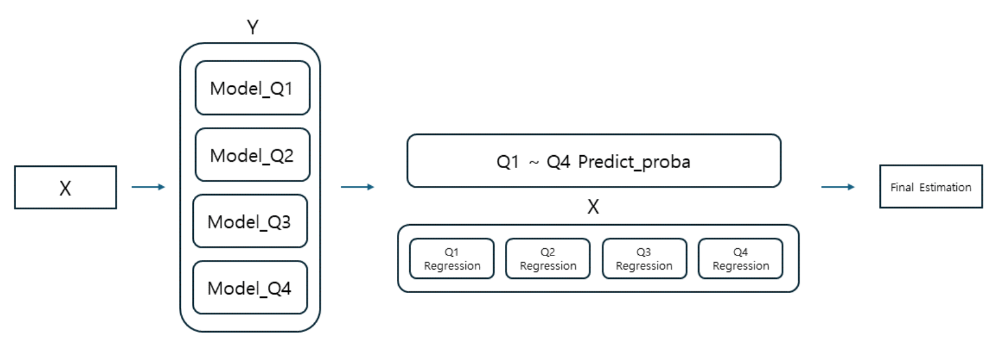

- 기본 학습 정보
  - 학습기간 : 2023.04 ~
  - 습득방법 : 독학, 사설교육기관, 대학원, Kaggle / DACON 경진대회 참여
  - 히스토리
    - Repository
      - [머신러닝1](https://github.com/LJK1005/Portfolio/tree/main/res/01_Study/1st_Study/Machine%20learning)
      - [머신러닝2](https://github.com/LJK1005/Portfolio/tree/main/res/01_Study/2nd_Study/F.Machine_Learning)
      - [대회참여1](https://github.com/LJK1005/Portfolio/tree/main/res/01_Study/Kaggle_DACON)
    - 참여한 경진대회
      - [Kaggle1](https://www.kaggle.com/competitions/cat-in-the-dat)
      - [Kaggle2](https://www.kaggle.com/competitions/playground-series-s3e22)
      - [Kaggle3](https://www.kaggle.com/competitions/predict-energy-behavior-of-prosumers)
      - [Kaggle4](https://www.kaggle.com/competitions/playground-series-s3e26)
      - [DACON1](https://dacon.io/competitions/official/236193/overview/description)
- 상세 보유기술 요약
  - 학습 데이터의 기본 정보 확인
    - 데이터의 Shape를 조회하여 데이터의 크기 파악
    - Feature별 데이터 타입 및 기초통계량 조회
    - 종속변수 분포 확인 및 머신러닝 목표 설정
  - 데이터 전처리
    - 이상치 및 결측치 파악 및 정제
    - 수치형 데이터의 스케일링 (Standard / MinMax / Robust / LogScaling)
    - 범주형 데이터의 인코딩 (Onehot-Encoding, Label-Encoding)
    - 데이터 군집화 (K-means, DBSCAN 등)
    - 파생변수 생성, 차원 축소 등의 Feature Engineering (binning, PCA 등)
  - 모델 학습
    - 훈련 데이터셋 준비
      - 데이터의 특성에 따른 훈련 / 검증용 데이터 분리 (무작위, 시계열 기반 timeseries split 등)
    - 학습 모델 선정
      - 패키지로 제공되는 모델 활용 (scikit-learn 제공 모델, xgboost, lightgbm, catboost)
      - 앙상블 기법들의 종류 및 특성 이해 (voting, bagging, boosting, stacking)
    - 모델 훈련 및 성능 평가
      - 훈련 데이터셋을 사용한 모델 훈련
      - 모델 성능 평가를 위한 평가지표 활용(RMSE, MAE, accuracy, ROC_AUC 등)
      - 모델 성능 개선을 위한 하이퍼파라미터 튜닝

#### 2.1.4. 딥러닝

인공신경망을 통해 구현되는 딥러닝을 Python 상에서 활용할 수 있습니다. 분류 및 회귀 모델 훈련은 keras를 기반으로 하는 tensorflow를 활용하고 있으나 LLM에서는 pytorch의 활용 비중이 높아 해당 패키지의 사용법도 숙지하고 있습니다.

- 기본 학습 정보
  - 학습기간 : 2023.04 ~
  - 습득방법 : 독학, 사설교육기관, Kaggle / DACON 경진대회 참여
  - 히스토리
    - [Github1](https://github.com/LJK1005/Portfolio/tree/main/res/01_Study/1st_Study/Deep%20Learning)
    - [Github2](https://github.com/LJK1005/Portfolio/tree/main/res/01_Study/2nd_Study/H.Deep_Learning)
- 상세 보유기술 요약
  - 딥러닝 기본 사항
    - 인공신경망의 구조와 특성, 머신러닝과의 차이점 이해
    - 딥러닝 관련 패키지 사용 (tensorflow, pytorch)
  - 인공신경망 구성
    - Layer 구조의 이해 및 Sequantial 모델 생성
    - 다중 은닉층 구성 (Dense, CNN, RNN 및 파생 Layer)
    - 활성화 함수의 종류와 각 특성의 이해
    - 모델 성능 개선을 위한 Dropout, BatchNormalization, Polling 층 활용
  - 인공신경망 훈련
    - 옵티마이저, 손실함수, 평가지표의 종류의 이해
    - 훈련 데이터로 인경신경망 훈련 및 성능평가
    - 모델 튜닝으로 성능 개선

#### 2.1.6. etc

Python 사용시 반복적인 작업을 빠르게 수행하기 위해서 패키지를 직접 만들어서 활용한 경험이 있습니다.

ex) 데이터 전처리 : 이상치, 결측치, 스케일링, 인코딩을 한번에 수행하는 패키지 구성

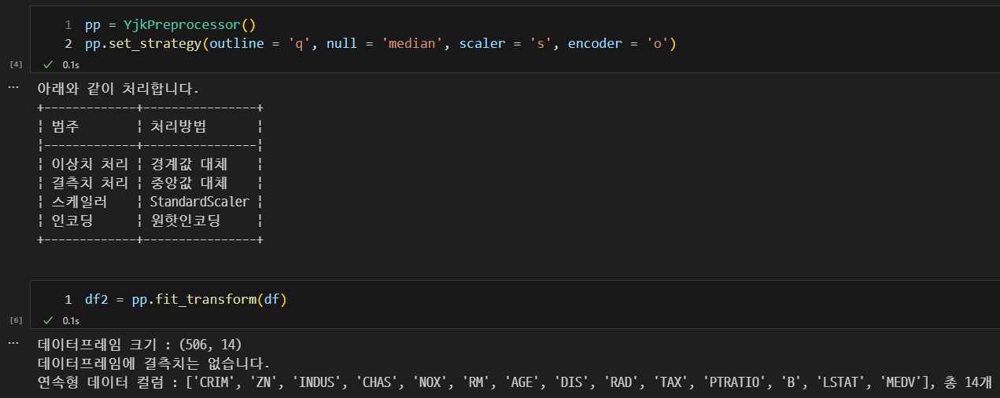

- [Github1](https://github.com/LJK1005/Portfolio/blob/main/res/03_etc/Package/yjk_module/preprocessing.py)

### 2.2. AI

#### 2.2.1 LLM

현재 AI 시장의 트렌드는 단연 생성형 AI라고 할 수 있습니다. LLM은 텍스트 데이터의 토큰화 과정을 통해 학습이 가능한 형태로 가공 후 학습하여 고전적인 분류의 활용은 물론이고 텍스트 생성을 비롯한 생성형 AI로서의 역할도 할 수 있으며, Stable Diffusion으로 대표되는 이미지 생성 모델과 함께 각 기업들이 큰 관심을 가지고 연구하는 분야입니다.

저 또한 이러한 트렌드에 따라가기 위하여 LLM의 사용법을 이해하고자 관련 내용과 지식을 습득, 직접 모델을 사용하여 경험을 축적하고 있습니다.

개인이 LLM을 사용함에 있어 가장 큰 걸림돌은 문자 그대로 큰 모델로 인한 매우 많은 파라미터로 모델이 매우 무거운 편이라는 점입니다. 개인용으로 사용할 수 있는 GPU 중에서 VRAM 용량이 큰 제품은 24GB 혹은 32GB로 (현재 개인 사용 GPU는 VRAM 32GB인 Geforce RTX 5090), 이를 사용하더라도 파라미터가 많은 모델들은 OOM(Out Of Memory) 에러로 인하여 순정으로 사용하는것이 사실상 불가능합니다. (skt/ko-gpt-trinity-1.2B-v0.5 사용시 VRAM 22GB 점유 확인) 이를 극복하기 위해서는 모델 양자화, LoRA(Low Rank Adaption) 등의 방법으로 모델을 경량화할 수 있으며 이를 통해 7B Mistral, 10.7B Solar 등의 모델에 대한 Fine-Tuning을 완료한 경험이 있습니다.

ex) google-bert/bert-base-uncased 모델의 LoRA + 양자화 미적용 / 적용시 VRAM 점유율 비교, 22GB -> 4GB로 VRAM 점유가 1/5 이하로 감소

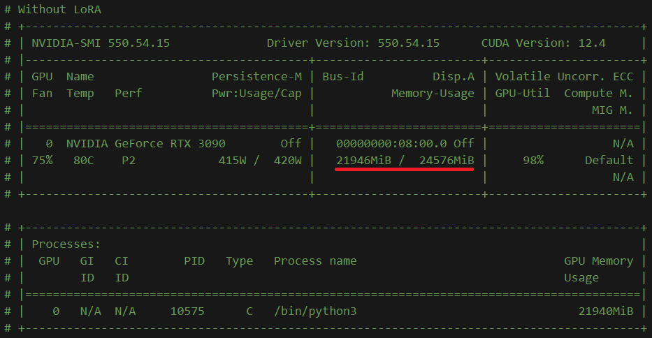

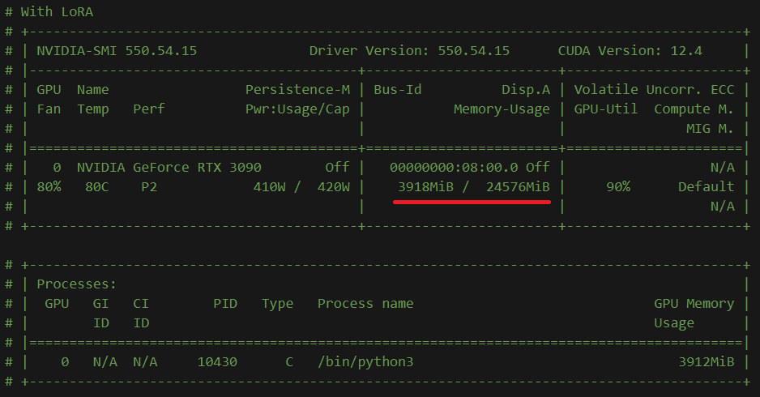

- 기본 학습 정보
  - 학습기간 : 2023.09 ~
  - 습득방법 : 독학, 대학원, Kaggle / DACON 경진대회 참여
  - 히스토리
    - Repository
      - [Github1](https://github.com/LJK1005/Portfolio/tree/main/res/01_Study/Kaggle_DACON/Dacon_0201)
      - [Github2](https://github.com/LJK1005/Portfolio/tree/main/res/01_Study/Kaggle_DACON/Kaggle_0424)
    - 참여한 경진대회
      - [DACON1](https://dacon.io/competitions/official/236216/overview/description)
      - [Kaggle1](https://www.kaggle.com/competitions/learning-agency-lab-automated-essay-scoring-2)
- 상세 보유기술 요약
  - LLM과 트랜스포머 신경망의 개념 이해
  - HuggingFace를 통한 모델 및 토크나이저 활용
    - 사용 모델 : LLaMA, Google Gemma, BERT, Solar, Mistral, DeepSeek-R1 등
  - 텍스트 데이터의 전처리 수행 (형태소 분석, 불용어 처리 등) 및 토큰화
  - 훈련 데이터셋에 대한 모델 Fine-Tuning
    - 훈련된 LLM의 성능 측정 (코사인 유사도)
  - LoRA (peft)와 양자화 (bitsandbytes)를 사용한 모델 및 학습 경량화

#### 2.2.2. 생성형 AI 활용

생성형 AI 서비스의 활용은 이제 현업에서 필수적인 역량 중 하나로 지식 습득, 정보 및 데이터 요약, 인사이트 도출 등의 주요 업무들을 보조하는 용도로 활용하고 있습니다.

- 기본 학습 정보
  - 학습기간 : 2024.05 ~
  - 습득방법 : 독학, 대학원, 현업 종사
- 상세 보유기술
  - 챗봇을 활용한 업무 보조
    - 범용 AI : GPT-5
    - 추론 및 코딩 : gemini-2.5-pro, Claude 4 sonnet
    - 로컬에서 모델 다운로드 및 활용
      - DeepSeek-R1, Qwen 등
    - 코딩 보조 : Cursor, Github Copilot, Gemini CLI
  - 생성형 AI에서 원하는 결과물을 도출하기 위한 Prompt Engineering
  - Python 및 기타 스크립트 작성 시 AI 활용 (바이브 코딩)
  - Python 상에서 OpenAI API 및 Ollama, vllm API를 활용

#### 2.2.3. AI 워크플로우 구축

노드 기반의 자동화 플랫폼으로 AI를 활용한 업무 자동화를 구현할 수 있습니다. 최근 AI에서 중요성이 높아진 MCP에 대응하기 위해서 스킬을 키워나가고 있습니다.

- 기본 학습 정보
  - 학습기간 : 2025.03 ~
  - 습득방법 : 대학원, 독학
- 상세 보유기술
  - 노드 기반 자동화 플랫폼의 이해와 활용
    - n8n
    - ComfyUI
      - n8n 상에서 ComfyUI를 API 형식으로 호출
  - 자동화 플랫폼 상에서의 노드 활용
    - 챗봇 연동 (OpenAI API, Ollama API)
    - 논코딩 기반 RAG 활용 (Pinecone)
    - Google Drive API 연동 결과물 저장

### 2.3. SQL

SQL문을 이용한 데이터 조회, 수정, 삭제 등의 데이터 핸들링이 가능합니다.

주로 사용하는 DBMS 관리 도구는 DBeaver입니다.

- 기본 학습 정보
  - 학습기간 : 2023.03 ~
  - 습득방법 : 독학, 대학원, 사설교육기관
- 상세 보유기술 요약
  - 사용 DBMS
    - Oracle, MySQL(MariaDB)
  - DBMS 활용
    - 테이블의 조회 및 데이터 수정과 삭제 등
    - 서브쿼리의 활용
    - Python과 연동한 DBMS 데이터 관리 (cx_Oracle - Oracle)

### 2.4. Business Intelligence (BI) Tools

BI 툴은 데이터 분석 및 시각화 도구로서 데이터 분석가로서는 필수적인 역량입니다. 저 또한 이를 이용하여 데이터 소스로부터 필요로 하는 시각화 객체 생성 및 인사이트를 도출하는 방법을 학습하고 실무에 적용하고 있습니다.

#### 2.4.1. Microsoft Power BI

Power BI는 마이크로소프트 사에서 제작한 BI 툴로 Tableau와 함께 데이터 분석 현업에서 널리 쓰이는 BI 소프트웨어입니다.

- 기본 학습 정보

  - 학습기간 : 2024.11 ~
  - 습득방법 : 독학, 현업 종사
- 상세 보유기술 요약

  - CSV / JSON 등 원본 파일 혹은 Python / SQL을 이용하여 데이터 로드 및 Power Query를 통한 데이터 전처리
  - Power BI 내 차트, 테이블 등 시각화 객체의 생성을 통한 데이터 시각화
  - DAX 함수를 통한 열 및 측정값 생성 및 활용
  - Python과 연동한 데이터 로드 및 시각화 객체 생성
  - 데이터 분석을 통한 인사이트 도출 및 코멘트 전달
  - 작성한 보고서의 퍼블리싱

### 2.5. etc

#### 2.5.1. Streamlit 기반 웹 대시보드 구현

Python을 이용한 웹 프레임워크는 Django, FastAPI 등이 주로 사용되지만 저는 입문용으로 간편하게 사용할 수 있는 풀스택 프레임워크인 Streamlit을 이용하여 간단한 머신러닝 / 딥러닝 프로세스를 구현한 적이 있습니다.

- 관련 히스토리
  - [Github1](https://github.com/LJK1005/Portfolio/tree/main/res/03_etc/Former_works)

ex) 데이터 입력 및 조회

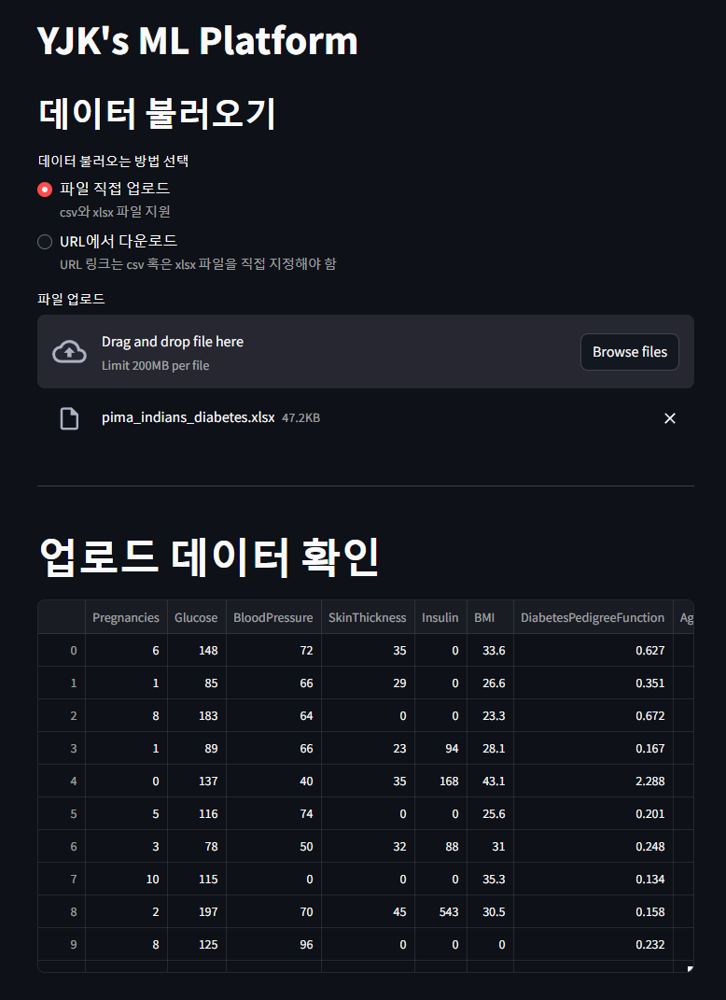

ex) 업로드한 데이터에 대한 전처리 수행

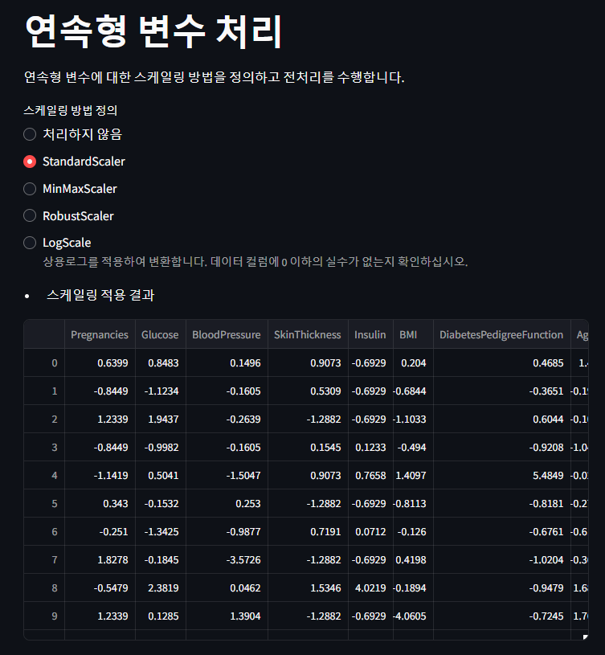

ex) 딥러닝 학습 수행 및 결과 확인


#### 2.5.2. 스프레드시트

Excel로 대표되는 스프레드시트는 최초 마케팅 업계 재직 당시 가장 높은 빈도로 사용하던 소프트웨어로, 각종 단축키와 함수를 비롯한 여러가지 기능에 대한 사용에 익숙해져 있어 간단한 데이터의 전처리와 분석을 수행할 수 있습니다.

Python을 접하기 이전부터 VBA 없이 기본 함수들을 적절히 사용하여 완전히 자동화된 크롤링까지는 구현하지 못하더라도 단일 페이지에 대한 스크래핑은 구현한 경험이 있습니다. 해당 결과물로 마케팅 회사 재직 당시 업무 효율을 크게 끌어올린 경험이 있습니다.

이 경험은 데이터 엔지니어링에 본격적인 관심을 가지게 된 계기가 되었으며 프로그래밍적 사고 형성에도 큰 도움이 되었다고 생각합니다.

- 원본 소스코드를 포함한 디렉토리
  - [Github1](https://github.com/LJK1005/Portfolio/tree/main/res/03_etc/Streamlit_API/Streamlit)

ex) 타겟 페이지의 소스를 스프레드시트에 입력하여 원하는 결과 (쇼핑몰의 상품명, SKU 등의 정보)를 가공 및 출력하는 함수 구성

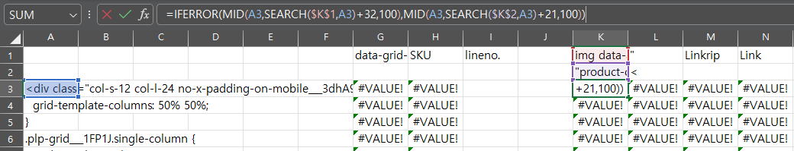

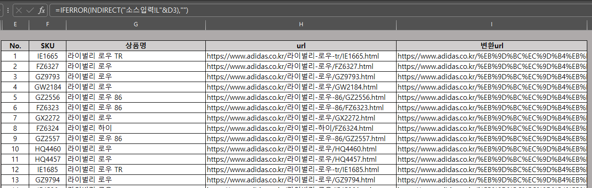

#### 2.5.3. 업무 자동화

Python 및 Linux에 대한 배경지식을 활용하여 각종 업무의 자동화가 가능합니다.

- 기본 학습 정보
  - 업무 자동화를 위한 Python 스크립트 작성
  - 작업 스케쥴링 등록 (cron 사용)
  - 작업 내역 로그 저장
- 상세 보유기술
  - API 및 크롤링을 통한 데이터 수집 및 전처리 자동화
  - SMTP 활용 메일링 자동화

## 3. Skill (Environment)

### 3.1. Windows

#### 3.1.1. Python 환경 구축

Anaconda3에 기반한 Python 데이터 분석 환경 구축을 수행할 수 있습니다. Anaconda3를 이용하면 기본 개발환경 구성에 더하여 필요시 추가적인 파이썬 환경을 구성하여 별도 파이썬 환경을 구축하여 별도 운영이 가능합니다.


Windows 환경의 경우 Linux에 비하여 딥러닝 관련 패키지 지원이 미비하여 버전 이슈를 겪거나 특정 기능을 지원하지 않는 경우가 많았습니다. 예를 들어, Nvidia 사의 CUDA 가속 장치를 딥러닝 학습 환경에서 이용하려고 할 경우 Tensorflow 패키지는 Windows 환경에서는 2.10 버전을 마지막으로 GPU 가속 지원이 중단되어 최신 버전의 Tensorflow에서는 GPU 가속환경을 사용할 수 없습니다. 딥러닝 공부를 수행하면서 많은 시행착오를 겪으며 찾은 개인적인 최적의 Python 환경 조합은 아래와 같습니다.

- Python 3.10 (3.11부터 Tensorflow 2.10.0 미지원)
- CUDA v11.8
- cuDNN 8.9.0
- Tensorflow 2.10.0
- Pytorch (CUDA v11.8 ver.)

위 환경대로 사용하더라도 일부 패키지는 버전 이슈가 여전히 발생하고 있어(ex. 모델 양자화에 사용되는 bitsandbytes 패키지는 최신 버전에서 이슈 발생) Linux 환경 구축에 관심을 가지게 된 계기가 되었습니다.

### 3.2. Linux

Linux는 Windows보다 데이터 분석 및 머신러닝 / 딥러닝 작업을 더욱 효율적으로 활용할 수 있는 환경입니다. 다만 일반인의 접근은 Windows보다 친화적이지 않아 저 또한 데이터 분석 직군에 관심을 가지고서야 직접적으로 접하게 되었습니다. 다만 데이터 분석이나 머신러닝 / 딥러닝 관련 업무를 한다면 Linux 환경은 필연적으로 접할 수 밖에 없기 때문에 Linux를 PC에 직접 설치하여 여러가지 기능을 직접 체험해보고 환경에 익숙해지고자 노력하고 있습니다.

- Linux 환경 구축 과정에서 기록한 작업별 노트
  - [Github1](https://github.com/LJK1005/Portfolio/tree/main/res/03_etc/Linux_and_Environment)
- Linux의 기능과 이해
  - Linux의 기본 명령어 사용
  - sudoer 권한에 대한 이해와 계정별 권한 부여 설정
  - vi, nano 에디터의 사용
  - cron 서비스를 통한 업무 자동화
  - tmux를 통한 다수 터미널 동시 활용

#### 3.2.1. Python 환경 구축

리눅스 배포판 중 우분투 설치 및 Python 환경 구축이 가능합니다. Windows 항목에서 상술한 바와 같이 데이터 분석 / 머신러닝 관련 패키지의 지원은 Windows보다는 Linux 환경에서 더욱 적극적으로 이루어지고 있기 때문에 Linux 환경을 직접 구축하였습니다. 사용중인 리눅스는 Ubuntu Server 22.04 LTS로, CLI 환경의 운영체제이며 불필요한 백그라운드 프로세스가 최소한으로 가동되기 때문에 컴퓨터 자원을 최대한으로 활용할 수 있습니다.

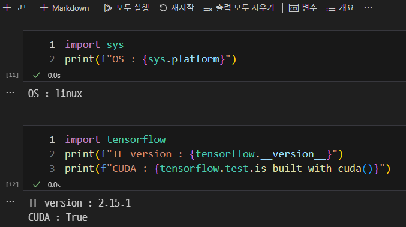

우분투 리눅스에서는 Windows와 다르게 패키지별로 최신 버전을 사용하더라도 GPU 등의 장치를 최상의 퍼포먼스로 활용할 수 있었습니다. (LLM 파인 튜닝 기준 Windows 대비 10% 빠르게 이루어짐)

- Python 3.12
- CUDA v12.8
- cuDNN 9.7.0
- Tensorflow 2.15.1
- Pytorch(CUDA v12.8 ver.)

#### 3.2.2. Jupyter Server와 SSH 원격 접속 환경 구축

Linux를 설치한 PC는 CLI 환경이기 때문에 해당 PC에서 직접 Python을 사용하는데는 여러가지 제약 사항이 있기 때문에 별도 클라이언트 PC를 통하여 작업하는 것이 바람직합니다. 이를 위한 원격 접속 환경을 구축하여 언제 어디서든 인터넷이 연결된 PC만 있다면 구축한 Linux 서버 PC에 원격으로 접속하여 데이터 / 머신러닝 작업이 가능하도록 세팅하였습니다.

별도 어플리케이션 설치 없이 Web 기반 Jupyter Notebook 서버를 구축하거나 VSCode 상에서 SSH로 Linux Python 환경에 직접 접속하는 환경을 모두 세팅하여 필요에 따라 적합한 방법으로 활용하고 있습니다.

ex1) Jupyter Notebook WebUI 서버 구축

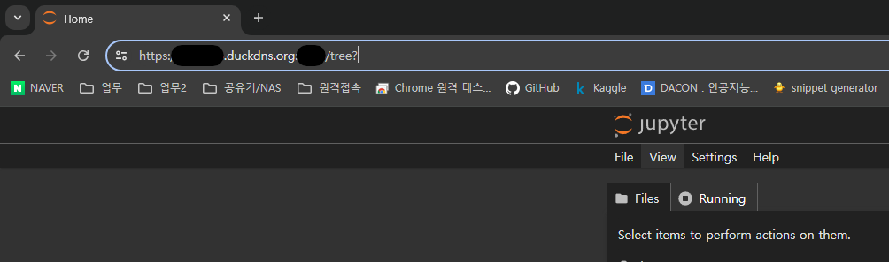

ex2) VSCode의 SSH 원격 접속을 통하여 Linux 환경에 접속

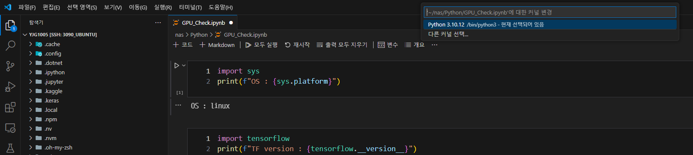

#### 3.2.3. Docker

Docker는 Linux의 대표적인 컨테이너 기술 및 서비스로 여러가지 서비스를 편리하게 운영할 수 있습니다. 딥러닝 환경을 예시로 하였을 때 직접 딥러닝 서비스를 구축하는 일련의 과정 (Python 패키지 설치, CUDA 환경 구축, Jupyter 서버 구현)을 미리 생성된 이미지를 로드하는 것 만으로 빠르게 수행할 수 있습니다. 저는 해당 서비스를 기반으로 GPU와 연동되는 Tensorflow - Jupyter 서버를 한번에 구축 가능한 이미지를 구동하여 활용한 경험이 있습니다. 다만 아직은 Docker 환경에 친숙하지 않아 직접 구축한 환경을 위주로 작업을 진행하고 있어 Docker에 대한 공부를 통해 더욱 능숙해지고나서 활용도를 차츰 늘려나갈 계획에 있습니다.

### 3.3. etc

#### 3.3.1. 개인 개발환경 구축

상기한 바와 같이 Windows와 Linux 환경을 모두 운영하고 있고 (Windows PC와 Linux PC는 별개) 각 디바이스를 필요에 따라 모두 활용하고 있기에 일반적으로는 작업 환경 동기화가 되지 않는 단점이 있습니다. 저는 이러한 단점을 해소하고자 저의 개발환경에 NAS(Network Attached Storage)를 추가하여 활용중에 있습니다.

데이터 분석 / 머신러닝을 위한 데이터 원본, 코드를 저장하는 Python Root 폴더를 모두 NAS로 설정하여 사용하는 PC에 구애받지 않고 인터넷에 접속만 가능하다면 빠르고 편하게 활용할 수 있는 개인 클라우드 환경을 구축하였습니다. 로컬 네트워크 상에서의 Windows 및 리눅스, 외부 WAN을 통하여 접속하는 Windows 컴퓨터는 모두 다른 방식으로 NAS를 운영체제에 마운트하여 저장소에 접근할 수 있는 방법에 대해 이해하고 있습니다.

가정 환경 특성상 WAN IP는 변할 가능성이 있으므로 외부 접속시 이에 영향을 받지 않도록 DDNS 도메인을 등록하여 접속에 활용중이며, 보안을 위한 비밀번호 설정은 물론 SSH 프로토콜 접속시에는 비밀번호보다는 인증키를 활용하고 있으며 Jupyter 웹 서버에도 인증서를 등록하여 https 접속을 활성화하였습니다. 포트 또한 LAN 내부에서는 디폴트로 설정된 포트를 쓰고 있지만 외부 접속시에는 라우터에 포트포워딩을 설정하여 다른 포트로 접속하도록 하고 있습니다.

ex) 개인 개발환경 도식화

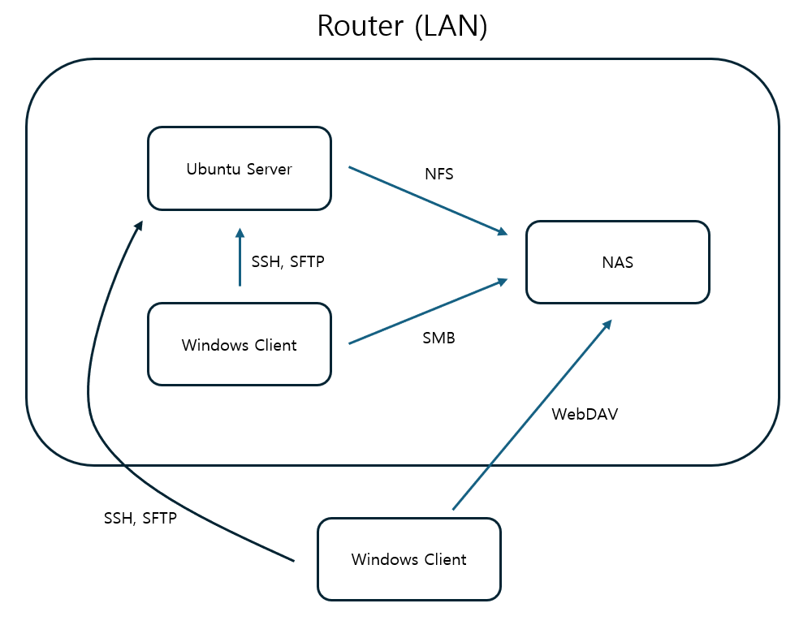

#### 3.3.2. 사내 협업 소프트웨어

과거 및 현재 직장에 재직하면서 사내 협업에 도움이 되는 메신저와 이슈 트래커를 사용한 경험이 있습니다.

- Microsoft Teams
- Slack
- Atlassian
  - JIRA
  - Confluence

## 4. Project

### 4.1. 데이터 수집 프로젝트

데이터 수집 능력을 평가하는 프로젝트 결과물입니다. 데이터 수집은 네이버 쇼핑몰의 리뷰 데이터를 수집하여 DB에 입력하는 것을 최종 목표로 하였습니다.

일련의 과정은 클래스 객체를 정의하여 실제 데이터 수집시 입력하는 코드를 최소화하는 것으로 목표로 프로젝트를 진행하고 결과물을 산출하였습니다. DBMS 연동 시 데이터형과 관련한 이슈가 발생하였으나 최종적으로는 해당 문제를 해결하여 만족스러운 결과를 산출한 프로젝트입니다.

ex) 데이터 수집 클래스 구성 설명

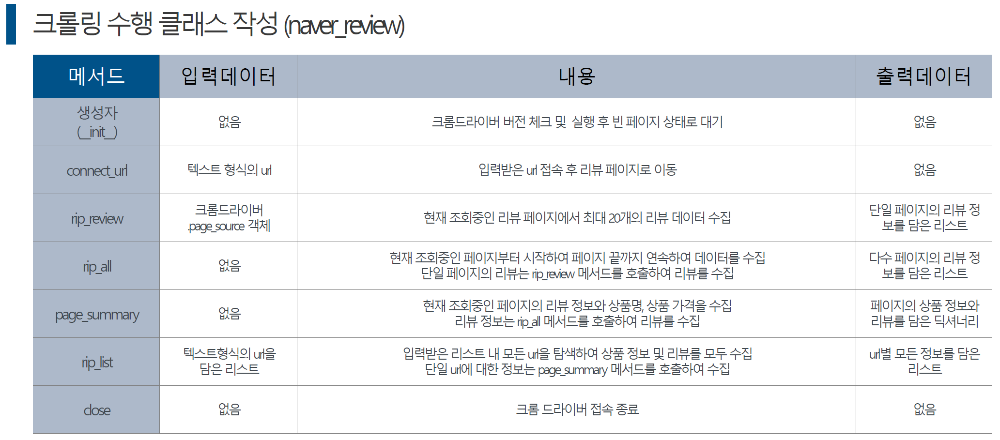

ex) 프로젝트 DB 입력 예시

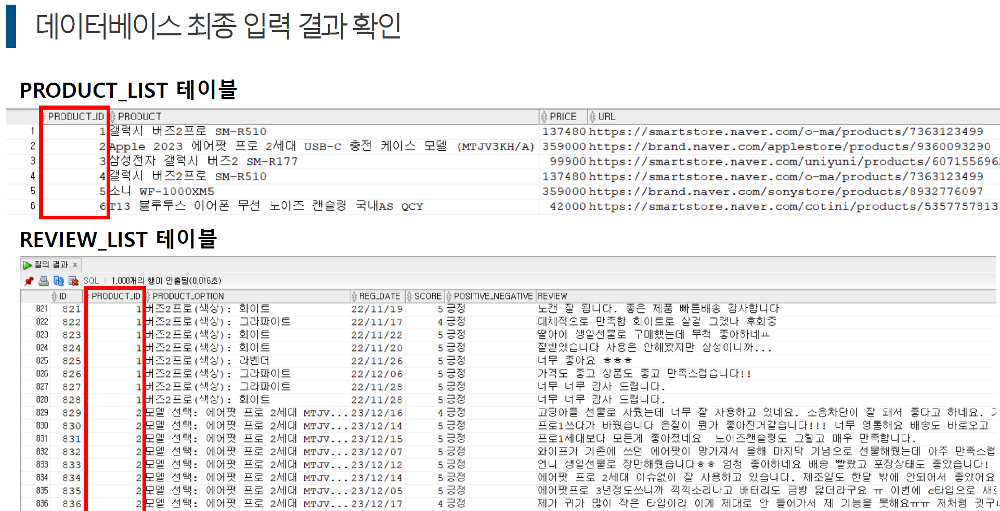

- 프로젝트 기본 정보
  - 진행기간 : 2023.12
  - 프로젝트 목표와 타겟 : 네이버 쇼핑몰에서 이어폰과 관련된 상품페이지에서 리뷰 데이터 추출
    - 리뷰 데이터는 날짜, 별점, 리뷰 내용을 수집
  - 진행 히스토리
    - [Github1](https://github.com/LJK1005/Portfolio/tree/main/res/02_Projects/Project01)
- 프로젝트 진행 절차와 코드 정보
  - 코드 구성은 웹페이지에서 데이터를 수집하는 클래스 1개, 수집한 데이터를 DBMS에 연동하여 입력하는 클래스 1개로 구성
  - 데이터 수집 클래스
    - 네이버 쇼핑은 JavaScript 기반으로 크롤링에는 Selenium 사용
    - 타겟 URL 접속 - 조회된 리뷰 데이터 수집 - 리뷰 페이지 이동 및 재수집 - 마지막 페이지까지 수집하고 수집 데이터 반환으로 구성됨
  - DBMS 연동 클래스
    - 데이터를 입력할 클래스 생성 - 테이블에 데이터 입력 단계로 구성
    - DBMS 연동용 쿼리문 구성에서 Python 스크립트와 SQL문의 구성을 파괴할 수 있는 일부 특수문자에 대한 처리 사전 진행
- 프로젝트 결과와 의의
  - 웹페이지에서 데이터를 크롤링 할 수 있음
  - Python 상에서 Oracle DB와 연동하여 데이터를 직접 입력할 수 있음

### 4.2. 탐색적 데이터 분석 프로젝트

탐색적 데이터 분석 능력을 확인할 수 있는 프로젝트를 진행한 결과물입니다. 저는 경마 경기 결과를 이용하여 경기 결과와 관련된 여러가지 변수를 탐색하고자 했습니다. 데이터는 한국마사회에서 OpenAPI를 통하여 다수의 양질의 데이터를 제공하고 있어 해당 데이터를 수집하여 사용했습니다.

ex) 데이터 분석 결과 예시

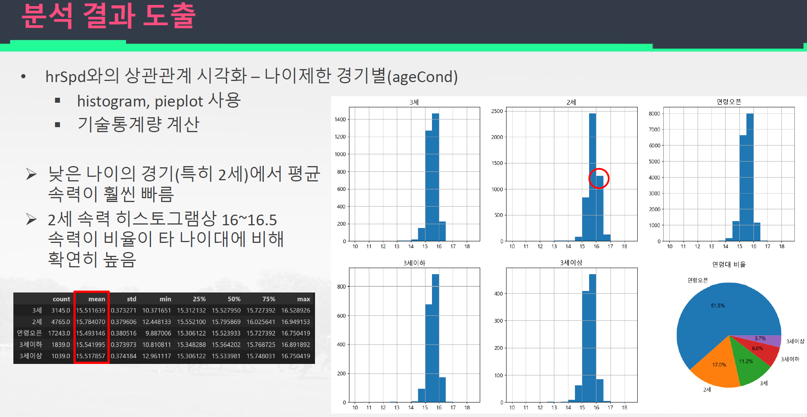

다만 프로젝트 진행 과정에서 경기 결과에 영향을 주는 요인을 찾는데 중심이 넘어가서 탐색적 데이터 분석보다는 확증적 데이터 분석과 추론통계에 가까운 결과물이 산출되어 다소 아쉬움이 남는 프로젝트가 되었습니다. 데이터 자체는 탐색적 데이터 분석을 충분히 할 수 있으며 차후 프로젝트 진행 시 원래의 목적을 다시 상기하며 작업을 진행하게 다짐하게 되는 경험이 되었습니다.

- 프로젝트 기본 정보
  - 진행기간 : 2024.01
  - 프로젝트 목표와 타겟 : 데이터의 수집과 탐색적 데이터 분석
    - 대상 : 경마 결과 데이터
  - 진행 히스토리
    - [Github1](https://github.com/LJK1005/Portfolio/tree/main/res/02_Projects/Project02)
- 프로젝트 진행 절차
  - 데이터 수집 : 한국마사회에서 제공하는 OpenAPI로 데이터 수집
  - 수집한 데이터에 대한 데이터 분석과 기초통계량 확인 및 각 데이터에 적합한 그래프를 활용하여 데이터 시각화 및 분석 진행
- 프로젝트 결과와 의의
  - OpenAPI를 통한 데이터 수집 과정 이해
  - 데이터 분석과 시각화 능력 향상

### 4.3. 머신러닝 / 딥러닝 프로젝트

데이터 수집부터 전처리, 머신러닝 / 딥러닝 모델을 직접 선정하여 결과를 산출하고 그 의의를 찾는 프로젝트를 진행했습니다. 해당 프로젝트는 고용노동부에서 주최하는 데이터 공모전에 참여하는 목적이 있었습니다.

제가 참여한 팀에서는 산업 재해 데이터를 수집하고 모델 훈련과 그 결과를 토대로 산업 재해의 원인과 위험도를 사전에 측정하고 산업 재해를 예방할 수 있는지에 관하여 탐구하였습니다.

ex) 산업 재해 발생 유형을 예측하는 모델 성능 예시

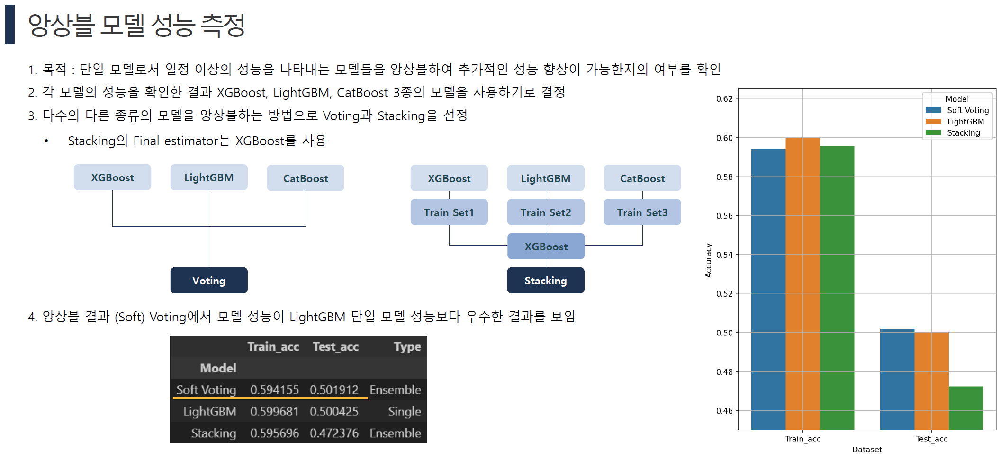

산업 재해 발생의 원인은 다양한 요인에 의해 발생하지만 발생 여부를 결정하는 가장 주요한 요인은 안전 교육과 방호 대책의 유무였습니다. 모델 성능 또한 기대한 수준으로 확인되어 원인 및 결과 분석, 연구 결과의 도출에 있어서 유의미한 결과가 나왔다고 생각합니다.

- 프로젝트 기본 정보
  - 진행기간 : 2024.04 ~ 2024.08
  - 프로젝트 목표와 타겟 : 머신러닝 프로젝트의 전체 과정 구성
    - 대상 : 산업 재해 데이터
    - 선정이유 : 산업 재해가 발생하는 요인에 대해 분석하고 이를 예방할 수 있는 방안 모색
  - 프로젝트 구성인원 4인
  - 진행 히스토리
    - [Github1](https://github.com/LJK1005/Portfolio/tree/main/res/02_Projects/Project03)
- 프로젝트 진행 절차
  - 프로젝트 목표 수립
  - 프로젝트 진행에 필요한 데이터 수집 (Selenium을 이용하여 데이터 수집)
  - 머신러닝 / 딥러닝 적용을 위한 데이터 가공 및 전처리
    - 정제되지 않은 텍스트 Feature에 대한 텍스트 분리 작업
    - 연속형 데이터에 대한 파생변수 생성 (PCA 적용)
    - 성능 향상에 도움이 될 별도 데이터 추가 수집 및 데이터 병합 (기상청 제공 기상 데이터)
  - 모델 선정 및 훈련, 하이퍼파라미터 튜닝을 통한 모델 성능 개선 작업
- 프로젝트 공헌 내역
  - 데이터 수집을 위한 크롤링 코드 작성 (기여도 70%)
  - 수집된 데이터 전처리 작업 (기여도 50%)
  - 머신러닝 모델 구현 (기여도 50%)
  - 딥러닝 모델 구현 (기여도 100%)
- 프로젝트 결과와 의의
  - 데이터 수집 ~ 모델 훈련 및 결과 해석에 이르기까지 머신러닝 프로젝트의 모든 과정을 진행하고 그 프로세스에 대한 능력 향상
  - 프로젝트 내용의 의의
    - 산업 재해를 원인을 파악할 수 있는 요인 예측
    - 산업 재해를 예방하기 위한 적합한 방안 제안 가능
    - 연구결과를 국가, 기업, 개인별로 적합하게 활용할 수 있는 계기 마련

### 4.4. 사내 광고 데이터 수집 및 BI 기반 시각화 프로젝트

현업에서 수행하게 된 최초의 프로젝트로, 기존 사내에서 사용되고 있던 Excel 기반 광고 성과 보고서를 PowerBI로 재구현하고 데이터에 대한 인사이트를 도출할 수 있도록 개선하는 프로젝트를 진행하였습니다. Python을 메인으로 사용하여 실무에서 처음으로 데이터 파이프라인을 구축하고 결과물을 생산한 뜻깊은 경험이었지만 다른 조직원의 백업 없이 사실상 혼자서 진행한 업무였기에 프로젝트 진행 도중 많은 어려움을 겪었으며 그 결과물에 대해서도 여러 한계점을 인식할 수 있었습니다.

- 프로젝트 기본 정보
  - 진행 기간 : 2025.02 ~ 지속 관리 중 (최초 결과물 구현은 2025.03)
  - 프로젝트 목표와 타겟 : Excel 기반 보고서의 PowerBI 전환
    - Excel을 사용하던 보고서를 PowerBI로 전환함으로서 보다 고도화된 시각화 보고서를 제공
    - 기존 보고서에서의 데이터 수집 체계 개선
    - 필요에 따라 추가적인 보고서 기능 추가
  - 프로젝트 구성 인원 : 1명
    - 사수나 실무 담당 팀장이 없어 데이터 수집부터 보고서 작성에 이르는 모든 과정을 혼자 진행하였으며, 실무 지식이 있는 대표이사의 간헐적인 피드백만으로 지시사항 접수 및 수정을 진행함
    - 위에 따라 전 과정의 기여도는 100%
  - 사용한 주요 기술 스택
    - Python
      - 플랫폼 별 API
        - [네이버검색광고 API](https://naver.github.io/searchad-apidoc/#/guides)
        - [카카오모먼트 API](https://developers.kakao.com/docs/latest/ko/kakaomoment/reference)
        - [Google Sheets API](https://developers.google.com/workspace/sheets/api/reference/rest?hl=ko)
        - [Google Ads API](https://developers.google.com/google-ads/api/docs/start?hl=ko)
        - [Google Analytics Data API](https://developers.google.com/analytics/devguides/reporting/data/v1?hl=ko)
        - [Meta 마케팅 API](https://developers.facebook.com/docs/marketing-apis?locale=ko_KR)
        - [네이버 데이터랩 API](https://developers.naver.com/products/service-api/datalab/datalab.md)
      - Selenium
      - Pandas
    - Microsoft PowerBI
      - Power Query (M Code)
      - DAX
    - Linux
      - cron
- 프로젝트 진행에 따른 기능 구현
  - 데이터 수집
    - 사내에서 집행하는 광고들의 성과 데이터를 수집하는 방법 탐색
    - 광고 매체에 따라 API를 제공하는 경우가 있으면 API를 통하여 광고 성과 데이터를 수집하고 아닌 경우에는 동적 크롤링을 통하여 데이터를 수집하고 JSON 형식으로 데이터를 저장
    - 매일마다 전일자 데이터를 자동으로 누적할 수 있도록 하기 위해 데이터를 누적하는 Python 스크립트 작성 및 사내 서버를 이용하여 스케쥴링을 통해 자동화
      - 데이터 수집을 진행하는 디바이스는 사내 Linux 서버로 개인 업무용 컴퓨터의 활성화 여부와 무관하게 주기적으로 데이터를 수집 및 저장함
  - 데이터 전처리 및 저장
    - 각 매체별로 수집하는 광고 데이터는 매체별로 독자적인 형태를 취하고 있어 하나의 데이터로 합치기 위해서는 데이터 전처리가 필수적
      - 해당 전처리를 수행하기 위해서는 데이터 전처리를 위한 Python 지식과 더불어 퍼포먼스 광고에 대한 도메인 지식이 필요
    - 통합 보고서를 위한 데이터의 메타데이터를 정의하고 그 형태에 맞게 각 매체의 데이터를 전처리하는 프로세스 구축
    - 전처리를 진행한 광고 데이터는 사내 서버에 저장되며 해당 프로세스는 자동화되어 매일 데이터를 수집 및 가공하여 저장
  - BI를 이용한 보고서 구현
    - PowerBI를 이용하여 저장한 데이터들을 불러오고 Python, M Code, DAX를 통한 추가적인 데이터 전처리 수행
    - 테이블, 차트 등 각종 시각화 객체로 데이터 시각화
    - 슬라이서를 활용한 다이나믹 차트 구현
    - 북마크를 활용하여 활성되는 객체 전환
    - 최종 완성된 보고서를 활용하여 인사이트 제공
    - 보고서의 퍼블리싱을 통한 사내 공유
- 프로젝트 성과
  - 자동으로 데이터 수집 및 전처리를 진행하는 데이터 파이프라인 구축
  - Excel 기반 보고서를 PowerBI를 통해 동적인 시각화를 구현하고 보고서 기능 개선 및 추가
  - 기존 Excel 기반 보고서의 데이터 수집 한계점을 크게 개선
    - Excel 보고서 : 각 광고 매체의 전체 데이터만을 월별로 수집하여 상세한 데이터 분석이 불가능
    - PowerBI 보고서 : 각 광고 매체의 최소 단위 (광고 에셋, 키워드 등)로 일별로 데이터를 수집하여 (raw 데이터) 보다 고도화된 데이터 분석이 가능하도록 구현
  - 시각화를 통한 비교 분석으로 보다 고도화된 인사이트 도출
  - 보고서의 퍼블리싱을 통한 공유
    - Fabric 플랫폼 기반 공유와 웹 퍼블리싱을 통한 html 객체 기반 공유 등 여러가지 공유 방법 활용
    - Microsoft PowerBI의 라이선스 구조 이해
  - 데이터 엔지니어링 및 분석 지식과 마케팅 실무 경험을 모두 갖추어 만들어진 결과물로 과거 보고서보다 우수한 보고 체계가 구축됨
- 프로젝트의 한계
  - Power Query의 이해도 부족으로 각 쿼리의 의존성의 복잡도가 높아 성능이 하락하는 문제가 발생
    - 추후 프로젝트 진행 시 쿼리 구조 개선 및 Python 데이터 전처리 비중을 늘리는 방안 등으로 개선하는 목표 수립
      - 현재 Power Query (M 코드)로 데이터 로드 및 전처리를 하던 부분을 대부분 Python으로 포팅 작업을 진행하여 성능 개선 완료
  - DB 미사용
    - 데이터 규모가 크지 않아 JSON 파일 형식으로 데이터를 수집 및 저장함
    - DBMS를 도입하지 않아 데이터 관리가 체계화되지 않고, SQL을 사용할 기회가 없어 숙련도를 쌓을 경험이 부족한 점은 개인적인 아쉬움으로 남음
      - 장기적으로는 DB를 도입하고자 하는 계획은 있으나 진행되지는 않았음