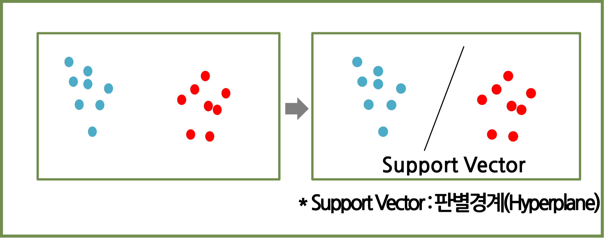
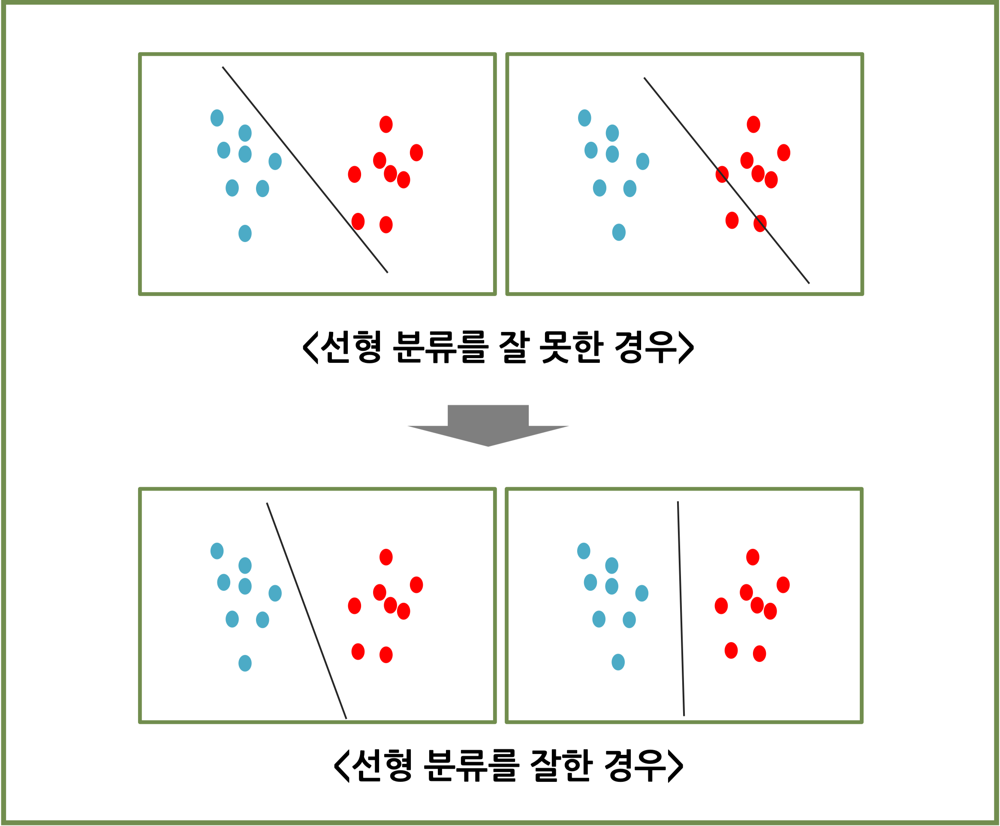
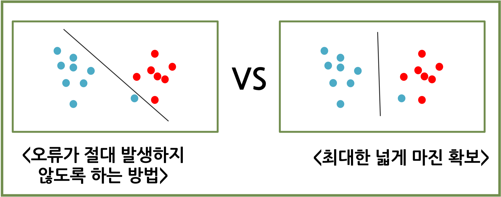
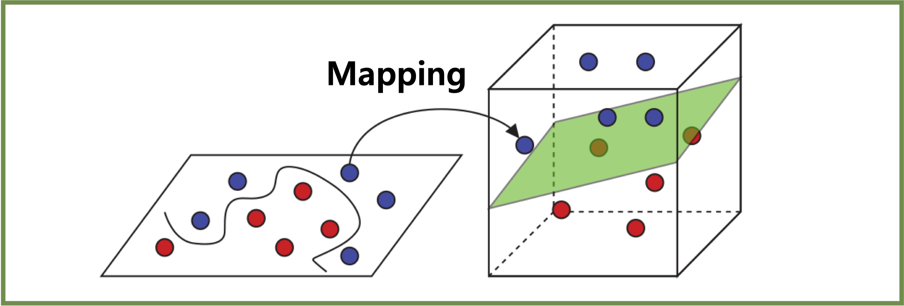
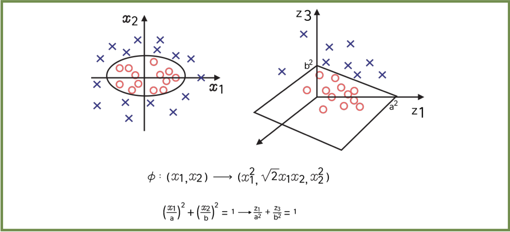

# SVM (Support Vector Machine)

## #01. 기본 개념

- $N$차원을 공간을 ($N-1$)차원으로 나눌 수 있는 **초평면(Hyperplane)**을 찾는 분류 기법
- 신경망에 비해 간결함.
- 분류나 회귀 문제를 해결하기 위해 사용 가능(주로 분류에서 사용)
- 기본적으로 판별경계(Hyperplane)을 이용해서 분류함

### 초평면?

| 종류 | 내용 |
|---|---|
| 직선 | 2차원의 초평면 |
| 평면 | 3차원의 초평면 |

## #02. 선형분류

- 평면 상태에서 초평면에 의해 분류가 가능한 상태

### [1] 어느 것이 잘 분류한 것인가?

- 어느 한쪽에 치우치지 않게 분류
- 공통되는 빈 공간의 경우에도, 양쪽 데이터와 균등한 위치에 기준을 세움

### [2] SVM의 분류 방법 - 마진

- 분류 기준선과 데이터간의 여유거리
- SVM 최고의 마진을 가져가는 방법으로 분류기준을 세움
- 비어 있는 마진이 많아야 새로운 데이터가 투입되어도 분류가 잘 될 가능성이 높다.

## #03. SVM의 장단점

### [1] 장점

- 범주나 수치 예측에 사용 가능
- 과적합이 발생하는 경우가 적음
- SVM 알고리즘이 신경망보다 사용하기 쉽게 구성된 것이 많음

### [2] 단점

- 최적의 모델을 찾기 위해서 커널과 모델에 대한 다양한 조합 테스트가 필요.
- 입력 데이터 셋이 클수록 학습속도가 느려질 수 있다.
- 다소 해석이 복잡함

## #04. SVM의 최적화

### [1] 데이터 특성에 따른 분류

일부 오류를 감안할 것인가? 최적 마진을 목표로 할 것인가?

### [2] SVM의 일반화 적용

#### (1) 마진이 넓은 것을 최우선(데이터 일반화)

- 일부 오류가 발생할 수 있음
- 새로 들어오는 데이터에 대해서는 마진이 넓어 잘 분류될 가능성이 높다.

#### (2) 오류 가능성을 최소(일반화 하지 않음)

- 오류 발생 가능성이 거의 없다
- 새로 들어오는 데이터에 대해서는 마진이 좁아서 분류가 잘못될 수 있다.

> SVM을 활용하는 데이터의 형태에 따라 일반화 적용 여부를 결정함

## #05. 비선형 데이터 분류

### [1] 비선형 데이터

- 초평면으로 데이터가 일정하게 나누어져 있지 않은 경우
- 하나의 직선으로는 분류가 불가능한 형태

### [2] 위상 변화를 통한 초평면 분류

- 데이터의 위상을 변화하여 초평면에 의한 분류가 가능하도록 함.
- 구별이 가능한 방향으로 Mapping 시키면 새로운 공간 영역으로 변환.
- 새로 생성된 공간 영역에서는 초평면 분류가 가능해 짐

### [3] 변형을 위한 커널 사용

#### Mapping을 통한 선형 구별

- X,Y 기준의 2차원 평면상에서 선형으로 구분이 불가능한 데이터라면 Mapping 함수를 활용하여 3차원으로 변형

#### 커널트릭(커널대체)

- 저차원에서 선형 구분이 불가능한 데이터를 고차원으로 변경해야 함.
- SVM은 최직선과의 거리 기반이므로 고차원 공간에서 두 벡터 X, Y의 거리를 필요로 함
- 고차원으로 변경된 데이터를 선형적으로 구분
- 커널트릭의 제약사항 : 활용할 수 있는 연산은 내적 연산만 가능
- 커널함수: 커널 트릭을 수행할 때 사용하는 함수

#### 커널을 사용할 때의 특징

- 최적화에 대한 복잡도 영향
- 이전 입력 공간의 영향을 받음
- 새로 옮겨진 특징 공간의 복잡도에 영향을 받지 않음
- Mapping을 통해 무한대의 공간으로 확장되어도 최적화에 문제가 없음

### [4] 커널함수

| 함수 | 내용 |
|---|---|
| poly (다항커널, Polynomial Kernel) | 입력의 모든 차원의 조합인 공간에서 내적을 계산한 것과 같은 결과를 반환 degree(차수), coef0(다차항 영향도 조절), C(오차비용,마진), gamma(결정경계 복잡도) 변수 사용 |
| rdf(Radial Basis Function) | 가우시안 커널(Gaussian Kernel)을 사용함 무한 차원으로 데이터를 옮긴 뒤 그 곳에서 내적을 계산한 것과 같은 결과를 반환 C(오차비용,마진), gamma(결정경계 복잡도) 변수 사용 |

#### 오차비용 (C, Cost)

- 각 포인트의 중요도를 제한하는 매개변수
- 값이 커질수록 결정경계가 데이터에 정확하게 맞춰진다.

| 구분 | 내용 |
|---|---|
| C값을 높이면 | - 마진을 줄임, 오류를 허용하지 않음 -과대적합 가능성 높아짐 |
| C값을 낮추면 | - 마진이 늘어남, 오류의 허용 정도를 높임 -과소적합 가능성 높아짐 |

#### 경계결정 복잡도 (Gamma)

- 하나의 훈련 샘플이 미치는 영향의 범위를 결정

| 구분 | 내용 |
|---|---|
| Gamma값을 높이면 | - 곡률(반경)이 작아짐, 모든 학습데이터에 맞춰 모델을 학습함 -과대적합 가능성 높아짐 |
| Gamma값을 낮추면 | - 곡률(반경)이 커짐, 집단을 러프하게 잡음 -과소적합 가능성 높아짐 |

## #06. sklearn의 Support Vector Machine 알고리즘

- sklearn에서는 `Support Vector Machine Classification`을 줄여서 `SVC`라고 부름
- 기본적으로 클래스에 대한 분류 확률을 제공하지 않는다.
    - `predict_proba()`메서드를 사용할 수 없음

| 종류 | 내용 |
|---|---|
| LinearSVC | - 선형 분류만 사용 가능함(커널트릭 사용 안함) - `predict_proba()`메서드를 사용할 수 없음 - `kernel='linear'` 파라미터를 설정한다면 `SVC()`와 유사함 - 규제에 편향을 포함하고 있어서 스케일링 작업을 수행하지 않으면 결과에 큰 차이가 생김. |
| * SVC | - 비선형 분류를 사용할 수 있음 - `probability = True` 파라미터를 통해 `predict_proba()`메서드를 사용할 수 있음 |
| NuSVC | - `Nu`파라미터가 추가된 `SVC()` - 기본적으로 `SVC()`와 유사함 |

